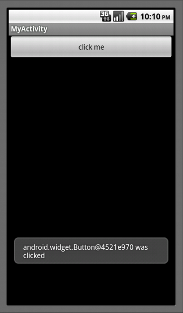
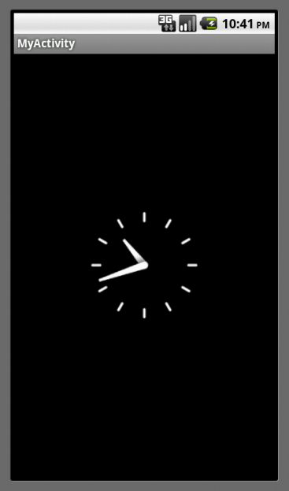
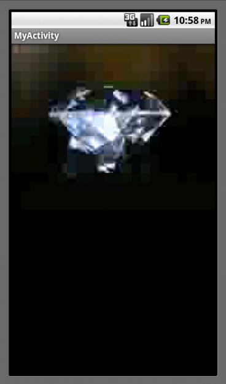

!SLIDE subsection
#Android API

!SLIDE bullets
* Log
* GUI
* Hardware
!SLIDE bullets transition=scrollUp
* Canvas
* WebView
* Multimedia

!SLIDE
#Log
    Log.d("My Activity", "here's what's up...")
!SLIDE commandline incremental
    $ adb logcat
    D/dalvikvm(  119): GC_EXPLICIT freed 1050 objects / 61056 bytes in 91ms
    I/dalvikvm(  253): Shrank stack (to 0x41869300, curFrame is 0x418695cc)
    D/My Activity(  253): here's what's up...

!SLIDE
#GUI: Layouts
    @@@ruby
    layout = LinearLayout.new(self)
    layout.orientation = LinearLayout::VERTICAL
    8.times {layout.add_view(Button.new(self))}
    self.content_view = layout
!SLIDE center transition=scrollUp

!SLIDE
#GUI: Buttons
    @@@ruby
    def on_create(bundle)
      layout = LinearLayout.new(self)
      button = Button.new(self)
      button.text = "click me"
      layout.add_view(button)
      self.content_view = layout
      button.set_on_click_listener do |view|
        Toast.make_text(
          self, "#{view} was clicked", 5000
        ).show
      end
    end

!SLIDE center transition=scrollUp

!SLIDE
#GUI: Text Fields
    @@@ruby
    edit = EditText.new(self)
    edit.text = "Hello!"
    self.content_view = edit
!SLIDE center transition=scrollUp

!SLIDE
#GUI: AnalogClock
    @@@ruby
    self.content_view = AnalogClock.new(self)
!SLIDE center transition=scrollUp

!SLIDE
#Hardware: TouchEvent
##Set up to receive events
    @@@ruby
    class MyView
      def initialize(parent)
        super
        request_callback CB_TOUCH_EVENT
      end
    end
!SLIDE transition=scrollUp
#Hardware: TouchEvent
##Handler method
    @@@ruby
    def on_touch_event(event)
      0.upto 10 do |id|
        index = event.find_pointer_index(id)
        break if index == -1
        x = event.getX(index)
        y = event.getY(index)
        Log.d(
          "ONTOUCH",
          "Pointer #{id}: #{x}, #{y}"
        )
      end
      true
    end
!SLIDE commandline incremental
    $ adb logcat
    D/ONTOUCH (  602): Pointer 0: 126.0, 251.0
    D/ONTOUCH (  602): Pointer 0: 105.0, 271.0
    D/ONTOUCH (  602): Pointer 0: 90.0, 284.0
    D/ONTOUCH (  602): Pointer 0: 66.0, 295.0
      
!SLIDE
#Hardware: Sensors
    @@@ruby
    Sensor::TYPE_ACCELEROMETER
    Sensor::TYPE_MAGNETIC_FIELD
    Sensor::TYPE_ORIENTATION
    #etc...

!SLIDE commandline incremental
    $ ruboto gen interface android.hardware.SensorEventListener \
      --name MySensorEventListener

!SLIDE transition=scrollUp
    @@@java
    import android.hardware.SensorEventListener;
    
    public class MySensorEventListener
      implements SensorEventListener
    {
      public void onSensorChanged(
        SensorEvent event
      ) {
        if (callbackMethods[CB_SENSOR_CHANGED]) {
          //JRuby calls to invoke
          //on_sensor_changed()...
        }
      }
    }
    
!SLIDE transition=scrollUp
    @@@ruby
    class MySensorEventListener
      def on_sensor_changed(event)
        values = event.values
        Log.d "", "x: #{values[0]}, " + 
          "y: #{values[1]}, " + 
          "z: #{values[2]}"
      end
    end
!SLIDE transition=scrollUp
    @@@ruby
    def on_create(bundle)
      @sensor_manager = get_system_service(
        Context::SENSOR_SERVICE
      )
      @sensor =
        @sensor_manager.get_default_sensor(
          Sensor::TYPE_ACCELEROMETER
        )
      @listener = MySensorEventListener.new
    end
!SLIDE transition=scrollUp
    @@@ruby
    def on_resume
      @sensor_manager.register_listener(
        @listener, @sensor,
        SensorManager::SENSOR_DELAY_UI
      )
    end
    def on_pause
      @sensor_manager.unregister_listener(
        @listener, @sensor
      )
    end
!SLIDE commandline incremental
    $ adb logcat
    D/        (23667): x: 1.1570, y: 1.2356, z: 9.5712
    D/        (23667): x: 0.9906, y: 1.2356, z: 9.6399
    D/        (23667): x: 0.8234, y: 1.2846, z: 9.6399
    
!SLIDE
#Canvas

!SLIDE transition=scrollUp
    @@@ruby
    class CanvasView

      def initialize(parent)
        super
        request_callback CB_DRAW
        invalidate
      end

!SLIDE transition=scrollUp
    @@@ruby
      def on_draw(canvas)
        red_oval(canvas)
        blue_box(canvas)
        fat_green_semitransparent_line(canvas)
      end

!SLIDE transition=scrollUp
    @@@ruby
      def red_oval(canvas)
        paint = Paint.new
        paint.color = Color.argb(255, 255, 0, 0)
        in_box = RectF.new(0, 0, 150, 200)
        canvas.draw_oval(in_box, paint)
      end

!SLIDE transition=scrollUp
    @@@ruby
      def blue_box(canvas)
        paint = Paint.new
        paint.color = Color.argb(255, 0, 0, 255)
        in_box = RectF.new(150, 300, 300, 500)
        canvas.draw_rect(in_box, paint)
      end

!SLIDE transition=scrollUp
    @@@ruby
      def fat_green_semitransparent_line(canvas)
        paint = Paint.new
        paint.color = Color.argb(150, 0, 255, 0)
        paint.stroke_width = 50
        canvas.draw_line(
          75, 100,
          225, 400,
          paint
        )
      end

    end

!SLIDE center transition=scrollUp

!SLIDE
#WebView
    @@@ruby
    web = WebView.new(self)
    web.load_url 'http://phillyemergingtech.com'
    self.content_view = web

!SLIDE transition=scrollUp
#Don't forget!
#in AndroidManifest.xml:

    @@@xml
    <uses-permission
      android:name="android.permission.INTERNET"
    />
!SLIDE center transition=scrollUp

!SLIDE
#Multimedia: Audio
    @@@ruby
    def on_create(bundle)
      request_callback CB_PAUSE
      file = File.new("sdcard/test.mp3")
      uri = Uri.from_file(file)
      player = MediaPlayer.create(self, uri)
      player.start
    end
    def on_pause
      player.stop
    end
!SLIDE
#Multimedia: Video
    @@@ruby
    view = VideoView.new(self)
    view.video_path = "sdcard/test.mp4"
    self.content_view = view
    view.start
!SLIDE center transition=scrollUp

