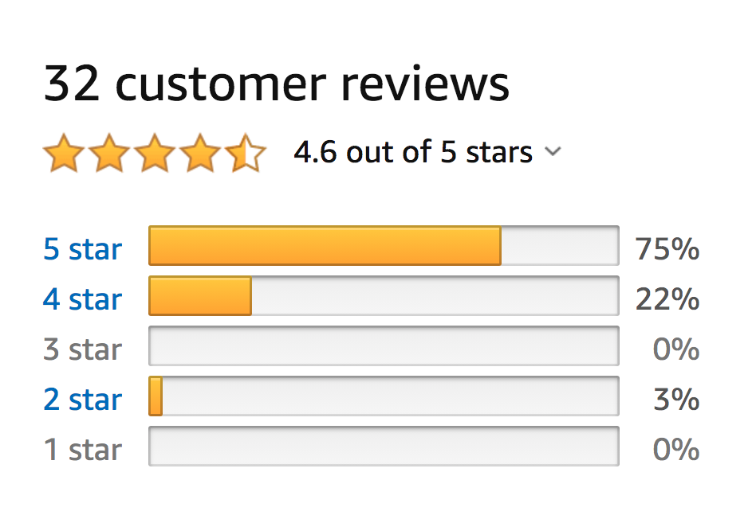
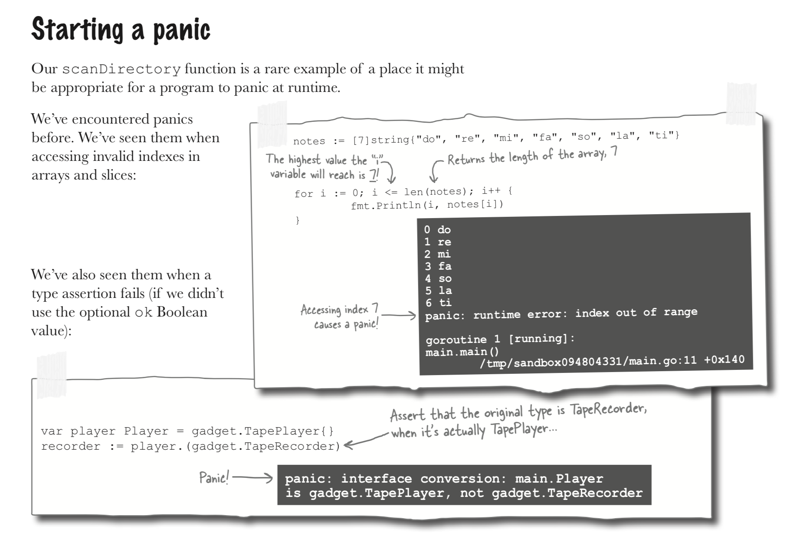
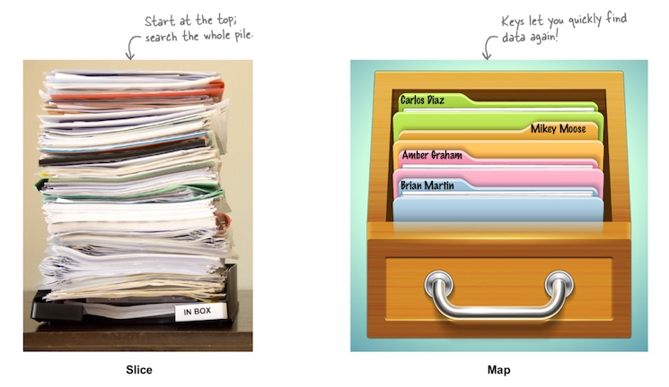

# Teaching Tech

## About Me

* Author of _Head First Ruby_ and _Head First Go_
* Total 4 years creating training for Code School, then Treehouse


## Why Listen To Me?

* I dunno!
* I don't _feel_ like my content should be that extraordinary...

## Head First Ruby Amazon Reviews



(The 2-star guy is mad the book isn't on Kindle Cloud Reader.) `¯\_(ツ)_/¯`

## Head First Go Amazon Reviews


(The 3-star guy is mad at the setup process for the Go toolchain.) `¯\_(ツ)_/¯`

## My Bible


## Minimize Page Flipping

"Have you ever read a book in which the text describes a visual located on the _back of the page_? ... The annoyance you feel [is due to] extraneous cognitive load needed to search for and integrate related information that is _physically separated_."

-Efficiency in Learning

## _Do_ Repeat Yourself

* In _Head First Go_, I didn't tell readers to refer back to page X.
* I copied content from page X onto the current page.
* I used a "torn page" effect to make it clear which parts were repetitions.



## Avoid Split Attention

"Split attention occurs when two mutually dependent visual sources of information are laid out in a format that requires the learner to mentally integrate them."

-Efficiency in Learning

## Avoid Split Attention

Don't make readers look all over the page/slide to assimilate information. Put related information together!

### Replace:

| Verb | Output |
| ---- | ------ |
| `%f` | Floating-point number |
| `%d` | Decimal integer |
| `%s` | String |
| `%t` | Boolean (`true` or `false`) |

``` go
fmt.Printf("%f\n", 1.234)
fmt.Printf("%d\n", 1)
fmt.Printf("%s\n", "a string")
fmt.Printf("%t\n", true)
```

Output:

``` go
1.234000
1
a string
true
```

### With:

``` go
// Floating point numbers: %f
fmt.Printf("%f\n", 1.234)      // => 1.234000
// Decimal integers:       %d
fmt.Printf("%d\n", 1)          // => 1
// Strings:                %s
fmt.Printf("%s\n", "a string") // => a string
// Boolean values:         %t
fmt.Printf("%t\n", true)       // => true
```

## Avoid Split Attention

The Head First series annotates all code samples.


## Use Understandable Motivating Examples

How _The Go Programming Language_ (Donovan and Kernighan) introduces `defer`:

``` go
func title(url string) error {
    resp, err := http.Get(url)
    if err != nil {
        return err
    }
    defer resp.Body.Close()
    ct := resp.Header.Get("Content-Type")
    if ct != "text/html" && !strings.HasPrefix(ct, "text/html;") {
        return fmt.Errorf("%s has type %s, not text/html", url, ct)
    }
    doc, err := html.Parse(resp.Body)
    if err != nil {
        return fmt.Errorf("parsing %s as HTML: %v", url, err)
    }
    // ...print doc's title element...
    return nil
}
```

## Use Understandable Motivating Examples

Other stuff the reader has to understand to get that example:

* `http.Get`
* HTTP headers
* `strings` package
* `html.Parse`

## Use Understandable Motivating Examples

```go
func Camp() error {
	var fire Fire
	fire.Light()
	// All you have to do is defer a call to Extinguish
	// right after you make a call to Light! Extinguish
	// will be called when Camp exits, whether Camp does
	// so normally or due to an error.
	defer fire.Extinguish()
	return fmt.Errorf("spotted a bear")
	fmt.Println("Toasting marshmallows")
	return nil
}
```

## Use Understandable Motivating Examples

Other stuff you have to understand to get that example:

* Camping

## Use Understandable Motivating Examples

* OK, OK, Donovan and Kernighan's approach is much more practical.
* Even _Head First Go_ went on to show a `defer` example that required `os.Open`, `os.File.Close` and more.
* But when first introducing a topic, make sure that topic is the _only_ new thing you're introducing.

## Pick and Choose Topics

"Good instructional design sorts out the need-to-know from the nice-to-know and tosses out the nice-to-know."

-Efficiency in Learning

* Attention is a finite resource!
* What is _your_ target audience ready to learn? (Not "able", "ready"!)
* What does _your_ target audience need to know?

## Break Down Topics

_Head First Go_ included a number guessing game that required learners to use:

* Reading strings from standard input
* Converting strings to numbers
* `if` statements
* Random number generation
* `for` loops

## Break Down Topics

If they got _any_ of these items wrong, they'd have a big program to debug. So I came up with a separate grading program that requires only part of these skills:

* __Reading strings from standard input__
* __Converting strings to numbers__
* __`if` statements__
* Random number generation
* `for` loops

## Break Down Topics

This allowed readers to become confident in the first group of skills, before adding in random number generation and `for` loops.

* __Reading strings from standard input__
* __Converting strings to numbers__
* __`if` statements__
* Random number generation
* `for` loops

## Manage Knowledge Dependencies


## Manage Knowledge Dependencies

Simple example: I realized I needed `%%` when demonstrating `Printf` format widths:

``` go
fmt.Printf("%%7.3f: %7.3f\n", 12.3456) // => %7.3f:  12.346
fmt.Printf("%%7.2f: %7.2f\n", 12.3456) // => %7.2f:   12.35
fmt.Printf("%%7.1f: %7.1f\n", 12.3456) // => %7.1f:    12.3
fmt.Printf("%%.1f: %.1f\n", 12.3456)   // => %.1f: 12.3
fmt.Printf("%%.2f: %.2f\n", 12.3456)   // => %.2f: 12.35
```

## Manage Knowledge Dependencies

...So I just went back and added it to the other verbs.

``` go
...
fmt.Printf("%s\n", "a string") // => a string
// Boolean values:         %t
fmt.Printf("%t\n", true)       // => true
// Literal % sign:         %%
fmt.Printf("%%\n")             // => %
```

## Manage Knowledge Dependencies

Prerequisite knowledge _has_ to be taught, or readers will be confused.

* Try to fit it in at the time you're teaching similar concepts.
* But if you have to, introduce it as an aside/detour.

## Anticipate Viewer Questions

### Original slide:

So, remember this excessively precise fractional number from before?

``` go
fmt.Println(1.0 / 3.0) // => 0.3333333333333333
```

`fmt.Printf` can help us round it off!

``` go
fmt.Printf("%0.3f\n", 1.0/3.0) // => 0.333
```

## Anticipate Viewer Questions

"But wait, what about `2.0 / 3.0`, which would be `0.6666666666666666`? Will `Printf` round the last decimal place up or just truncate it to `0.666`?"

* Leaving questions like this unanswered is worse than just leaving a gap in the viewer's knowledge.
* Not knowing distracts them from what you want to teach them next.
* Anticipating and answering questions instills faith in the technology ("oh, good, they thought of that") _and_ you, the teacher ("oh, good, the teacher thought of that").

## Anticipate Viewer Questions

### Updated slide:

So, remember this excessively precise fractional number from before?

``` go
fmt.Println(1.0 / 3.0) // => 0.3333333333333333
```

`fmt.Printf` can help us round it off!

``` go
fmt.Printf("%0.3f\n", 1.0/3.0) // => 0.333
```

Rounds last decimal up if appropriate:

``` go
fmt.Printf("%0.3f\n", 2.0/3.0) // => 0.667
```

## Reduce Extraneous Cognitive Load

* __Intrinsic cognitive load__: How inherently difficult your learning goal is.
* __Extraneous cognitive load__: Unnecessary mental work imposed by your materials.

## Reduce Extraneous Cognitive Load

* Here's a demonstration of underlying arrays for slices.
* Audience can figure out easily enough that `myArray[2]` changes the third element of `myArray`.

``` go
myArray := [5]string{"a", "b", "c", "d", "e"}
slice1 := myArray[0:3]
slice2 := myArray[2:5]
// Change an element of the underlying array!
myArray[2] = "X"
// Apparent contents of both slices change!
fmt.Printf("%#v\n", slice1) // => []string{"a", "b", "X"}
fmt.Printf("%#v\n", slice2) // => []string{"X", "d", "e"}
```

## Reduce Extraneous Cognitive Load

* But why impose that extra bit of mental effort? Just add one `Printf` call and _show_ them the effect on `myArray`.
* Then they can instead focus their attention on how the elements of `myArray` appear through the slices!

``` go
myArray := [5]string{"a", "b", "c", "d", "e"}
slice1 := myArray[0:3]
slice2 := myArray[2:5]
// Change an element of the underlying array!
myArray[2] = "X"
fmt.Printf("%#v\n", myArray) // => [5]string{"a", "b", "X", "d", "e"}
// Apparent contents of both slices change!
fmt.Printf("%#v\n", slice1) // => []string{"a", "b", "X"}
fmt.Printf("%#v\n", slice2) // => []string{"X", "d", "e"}
```

## Reduce Extraneous Cognitive Load

Let's go meta! The slide two slides back originally looked like this:

* Audience can figure out easily enough that `myArray[2]` changes the third element of `myArray`.

``` go
myArray := [5]string{"a", "b", "c", "d", "e"}
slice1 := myArray[0:3]
slice2 := myArray[2:5]
// Change an element of the underlying array!
myArray[2] = "X"
// Apparent contents of both slices change!
fmt.Printf("%#v\n", slice1) // => []string{"a", "b", "X"}
fmt.Printf("%#v\n", slice2) // => []string{"X", "d", "e"}
```

## Reduce Extraneous Cognitive Load

But why make _you_ figure out that it's a demonstration of underlying arrays for slices? I just added a bullet explaining what it was so we could focus on the concept of extraneous cognitive load.

* __Here's a demonstration of underlying arrays for slices.__
* Audience can figure out easily enough that `myArray[2]` changes the third element of `myArray`.

``` go
myArray := [5]string{"a", "b", "c", "d", "e"}
slice1 := myArray[0:3]
slice2 := myArray[2:5]
// Change an element of the underlying array!
myArray[2] = "X"
// Apparent contents of both slices change!
fmt.Printf("%#v\n", slice1) // => []string{"a", "b", "X"}
fmt.Printf("%#v\n", slice2) // => []string{"X", "d", "e"}
```

## Leverage Existing Knowledge

* Save viewers mental effort by basing new learning on concepts they already know about.

    Heard of "dictionaries" or "hashes"? Maps are Go's equivalent.

* Make sure they know about the concepts you're basing new learning on.
* Compare _and_ contrast; let them know where the metaphor breaks down.

## Leverage Existing Knowledge

* What about viewers who've never heard of "dictionaries" or "hashes"?
* Find something they _do_ know about!
* This is from Head First Go:



## Leverage Existing Knowledge

For this week's training, I used similar formats for the slices and maps sections, to stress their similarities:

### Maps

* Though maps work differently than slices, the syntax is similar.
* You're going to get some deja vu from the slices section.

TODO list of slices slide titles, map slide titles

## Keep it Concrete

Which is better, this wall of text:

## Keep it Concrete

* Heard of "dictionaries" or "hashes"? Maps are Go's equivalent.
* Like arrays and slices, maps store a collection of values.
* But arrays and slices use indexes to access their elements. Indexes can only be sequential integers.
* Maps use keys to store values under. A map's keys can be _any_ type you want!

## Keep it Concrete

...Or this wall of text with a code sample?

## Keep it Concrete

* Heard of "dictionaries" or "hashes"? Maps are Go's equivalent.
* Like arrays and slices, maps store a collection of values.
* But arrays and slices use indexes to access their elements. Indexes can only be sequential integers.
* Maps use keys to store values under. A map's keys can be _any_ type you want!

``` go
ranks := make(map[string]int)
ranks["gold"] = 1
ranks["silver"] = 2
ranks["bronze"] = 3
fmt.Println(ranks["gold"], ranks["bronze"]) // => 1 3
```

## Offer Practice

"Practice exercises matched to the learning objectives are one hallmark of effective courseware."

-Efficiency in Learning

## Fill in the Blank

Your goal is to define an interface that will allow a function to accept either of two different types.

* Define two types, `Whistle` and `Horn`, each with an underlying type of `string`.
* Define a `MakeSound` method for `Whistle` that prints "Tweet!". It should accept no parameters and return no values.
* Define a `MakeSound` method for `Horn` that's just like the method for `Whistle`, except it prints "Honk!".
* Define a `NoiseMaker` interface type that requires a `MakeSound` method. The `Whistle` and `Horn` types should both satisfy this interface.
* Define a `Play` function that accepts a parameter with the `NoiseMaker` interface. `Play` should call `MakeSound` on the parameter it receives.

## Fill in the Blank

Your goal is to define an interface that will allow a function to accept either of two different types.

* Define two types, `Whistle` and `Horn`, each with an underlying type of `string`.
* Define a `MakeSound` method for `Whistle` that prints "Tweet!". It should accept no parameters and return no values.
* Define a `MakeSound` method for `Horn` that's just like the method for `Whistle`, except it prints "Honk!".
* _Define a `NoiseMaker` interface type that requires a `MakeSound` method. The `Whistle` and `Horn` types should both satisfy this interface._
* _Define a `Play` function that accepts a parameter with the `NoiseMaker` interface. `Play` should call `MakeSound` on the parameter it receives._

## Fill in the Blank

``` go
type Whistle string
func (w Whistle) MakeSound() {
	fmt.Println("Tweet!")
}
type Horn string
func (h Horn) MakeSound() {
	fmt.Println("Honk!")
}

// YOUR CODE HERE:
// Define a NoiseMaker interface type, which the above
// Whistle, Horn, and Robot types will all satisfy.
// It should require one method, MakeSound, which has
// no parameters and no return values.

// YOUR CODE HERE:
// Define a Play function that accepts a parameter with
// the NoiseMaker interface. Play should call MakeSound
// on the parameter it receives.

func main() {
	Play(Whistle("Toyco Canary")) // => Tweet!
	Play(Horn("Toyco Blaster"))   // => Honk!
}
```

## Fill in the Blank

``` go
// Replace the blanks ("____") in the below code so that it
// compiles, runs, and prints the message "Hello, Gophers!".
____ main

____ "fmt"

____ main() {
	fmt.Println____"Hello, Gophers!"____
}
```

# Wrapping Up

## Further Reading

* __Efficiency in Learning__: Clarke, Nguyen, and Sweller, Pfeiffer 2005
* __Memory and the Human Lifespan__, Steve Joordens, Ph.D.: `https://www.thegreatcourses.com/courses/memory-and-the-human-lifespan.html`
* "A Guide to Better Technical Writing", Wade Christensen: `https://astuteape.com/writing/a-guide-to-better-technical-writing/`
* My book!


## Review These Slides

Visit `https://twitter.com/jaymcgavren`

### Your Practice

Incorporate some of these ideas into your next talk or training!
